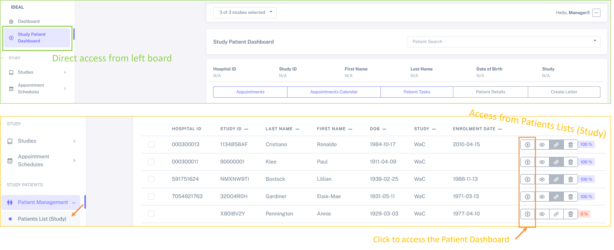
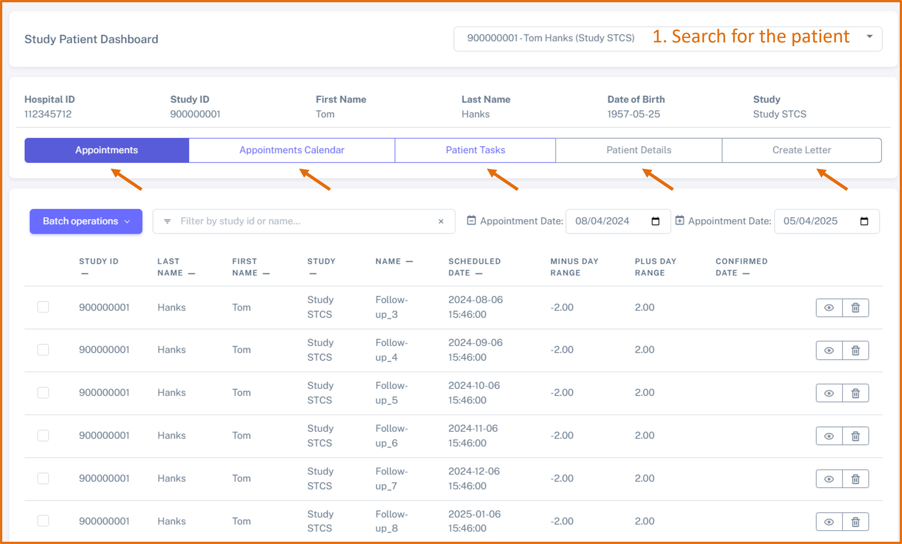

Patient Dashboard
####################

This dashboard was designed to streamline patient management inside a study.

How to access
****************

The patient Dashboard can be accessed directly from the left menu (as shown below in green) or by clicking on the icon indicated below in orange from the **Patients List (Study)**:

Major features
****************

The patient dashboard allows to easily access the following features:

1. `Appointments`_ - see all the appointments for a specific patient
2. Appointments Calendar - see all calendar appointments in the calendar for a specific patient
3. Patient Tasks - see all patient tasks associated with a specific patient
4. Patient Details - see the patient details
5. Create Letter - create a letter specifically for this patient

for this, you need first to search for one study patient. Then, you can navigate between the different containers (by clicking on them), as shown below.

