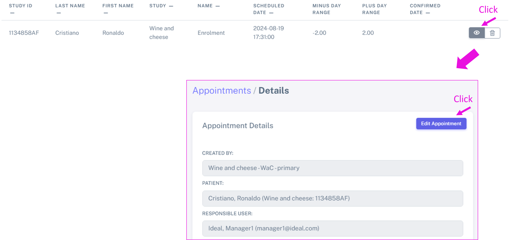

Appointments
##############

Appointments can be booked as **series** or **single** appointments.

In order to book **appointment series**, an **appointment schedule** needs to be created first. Check `here`_ how to do it.

To book **single appointments**, please check `below`_ how to do this.

.. _here:

Set and appointment schedule and book appointment series
****************************************************************

In order to book **appointment series**, an **appointment schedule** needs to be created first.

Therefore, you will need to: 

#. Set **Appointment schedule** - `this`_ will determine the frequency and the type of appointments for a schedule. The appointment schedule should be decided at at the **beginning** of the study and **before** starting to book appointments. Multiple appointments schedules are possible for the same study (to a maximum of 5).
#. Set "**Apointments**" for patients. Find `more`_ information below.

Let's look at these points in more detail.

.. _this:

Plan an appointment schedule - for a study
==============================================

.. warning:: Please set the appointment schedule at the **beginning** of the study, before starting to book the appointments for the different patients.

.. note:: Only the manager or user can set an appointment schedule for a study (and further booking appointments).

.. note:: Do not forget to select your study beforehand.

To create an appointment schedule navigate to: **Appointment schedules** > **Create Appointment Schedule**, under the "**Study**" section. Up to 5 appointment schedules are possible for each study.

Here you can specify the:

* **Type of visit**: *screening, randomization, enrolment, follow-up* and *unplanned*.
* **Additional name**: this is meant to be used when multiple appointments of the same type (for example, multiple follow-ups) are planned. Some studies also have defined names for the specific appointments, which can be specified in this field.
* **Years from day 1**: years from when patient joins the study.
* **Days from day 1**: days when patient joins the study.
* **Duration**: duration of the appointment - this is only relevant when booking the actual/definitive appointment, and it can be edited after. A *default* option is available as 00:30:00 (30 minutes).
* **Minus day range**: this is the lower tolerance range to book the actual/definitive appointment. It will be calculated around the *days from day 1*. The *default* option is -2 days. Currently, the minimum *minus day range* is -7.
* **Plus day range**: this is the top tolerance range to book the actual/definitive appointment. It will be calculated around the *days from day 1*. The *default* option is 2 days. Currently, the maximum *plus day range* is 7.
* **Repeat appoint.**: select "no repetition" if you don't want this appointment to repeat, otherwise several options to repeat appointments are available (every month, every 2nd month, etc).
* **Years repeat**: once an appointment is set to repeat, this option will appear. Here you can set for how many years your want your appointment to repeat.

.. note:: **Day 1** here will be the "reference" day from which the appointments dates are calculated. Day 1 will vary depending on the study. For example, for the STCS it will be the transplant date.

See below the appointment schedule for the study *Wine and Cheese*.

.. image:: AppScheduled.png
  :width: 1000      

We called this appointment schedule "WaC-primary". This appointment schedule starts with a "Enrolment" on day 1. A "Follow-up" appointment after 10 days, and then a series of monthly "Follow-up", for 10 years. Note how for each appointment type a different "plus" and "minus day range" can be set.

The appointment schedule can then be visualized by navigating to: **Appointment schedules** > **Appointment Schedule list**. When double clicking on the *Appointment settings* or using the dropdown menu (see orange arrows in the figure), the Appointment Schedule will expand.

.. image:: AppList.png

This appointment schedule can be edited or deleted using the following icons:

.. image:: AppEdit.png
  :width: 400

.. _more:

Plan an appointment series for a patient
==============================================

.. warning:: Make sure your Appointment Schedule is correct **before** booking any patient appointments.

.. warning:: An update to the Appointment Schedule *will not update* appointments *already booked* with a previous Appointment schedule.

Below, we will be *planning* appointments, i.e. scheduling the appointments timings. How to book the actual/definitive/confirmed appointments) will be shown in this `section`_. 

To plan appointments, and under the "**Study patients**" section, navigate to **Appointments** > **Create Appointment Series** to create an appointment series, make sure you select your study (in this case, *Wine and Cheese*) in the **Study filter**. Then, select the patient (for example here *Cristiano Ronaldo*) and the day 1 for this patient (preferred starting date and time) and save.

As shown above, the appointments have been scheduled accordingly with the appointment schedule described above ("WaC - primary). Note how the appointment dates were calculated on the *Day 1* (2024-08-19).

Plan an appointment series for multiple patients
====================================================

You can book appointments for multiple people, by holding the *ctrl* key while selecting the patients with the left-click of the mouse.

.. tip: when the *Patient* box is selected (see green rectangle highlighted in the previous figure), it is possible to search the patient by surname: just start typing the patient you want.

How to delete appointment series
===========================================================

In order to easily delete appointment series, you can navigate to **Appointments** > **Delete appointment series**, under the *Study patients* section.

Here, you need to select the schedule used to book the appointments and the patient. You will also have the option to delete only future appointments (for example, if the patient drops out from the study) or all the appointments.

Below you can see an example, in which all the future appointments of the patient *Angelina Jolie* are being deleted.

.. _below:

Plan a single appointment for a patient
*********************************************

To plan a single appointment for a patient (for example, an unplanned appointment), please navigate to: **Appointments** > **Create Single Appointment** and select the study (in **Study filter**). Select the patient, the type of visit and the scheduled date (appointment range and/or duration), and save. Fo example, David Beckham will have an unplanned appointment on the 27 of August 2024:

.. image:: AppSingle.png

This appointment can be then visualized together with the other appointments in:  **Appointments** > **Appointment List**.

.. note:: To schedule the actual/definitive/confirmed appointment time and day, check this `section`_.

.. _section:

How to visualize planned appointments
*******************************************************************

You can visualize these appointments (both planned in series and as a single appointment) in the **Appointments** > **Appointment List**. This table can be sorted by *Study ID*, *Last name*, *First name*, *Study*, *Name* (type of appointment), *Scheduled date* and *Confirmed date*. For that, just click on the **-**, as shown below (orange arrow).

.. image:: AppSeries2.png

You can also use the icons to either *View* or *Delete* the appointment.

How to book an actual/definitive appointment
**************************************************************

So far, we just *planneed* patient appointments. However, IDEAL also allows to register the actual/definitive appointment.

There are 2 ways of doing this:

Book an actual appointment via the **Appointments list**
=============================================================

For this, navigate to **Appointments** > **Appointments List** > **View** > **Edit Appointment**, as shown below (pink arrow):

This will open a new window where the details of this appointment can be seen. Here you can then select the **Actual date** (or definitive), as shown below:

.. image:: AppUpdate.png
  :width: 600

Book an actual appointment via the **Calendar**
=============================================================

You can also book the actual/definitive appointment directly from the **Calendar** (for more informations about the calendar, please check this section: :doc:`calendar`).

First, make sure you are on the *planned* view of the calendar. Then you just need to **double click** on the appointment and the window to update the appointment will appear as above.

