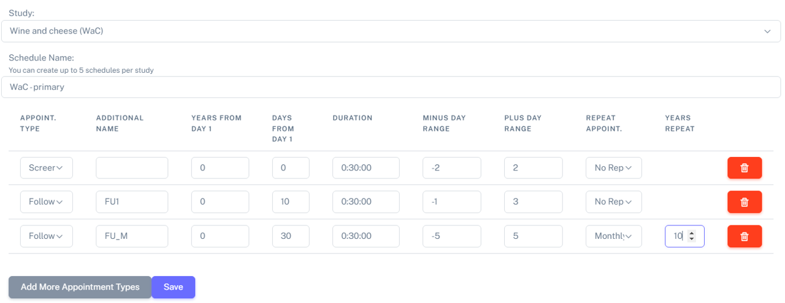
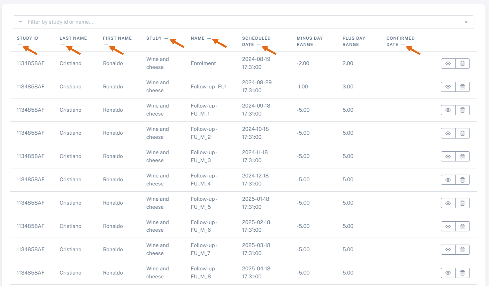

Appointments
##############

Appointments are subdivided into 2 sections:

#. "**Appointment schedules**" under the "**Study**" section: here you can create an apointment schedule for a study. This should be decided at at the **beginning** of the study and **before** starting to book appointments.

#. "**Apointments**" under the "**Study patients**" section to create appointments for specific patients.

Let's look at these points in more detail.

Plan an appointment schedule - for a study
********************************************

.. warning:: Please set the appointment schedule at the **beginning** of the study, before starting to book the appointments for the different patients.

.. note:: Do not forget to select your study beforehand.

To create an appointment schedule navigate to: **Appointment schedules** > **Create Appointment Schedule**.

Here you can specify different things:

* Types of appointments: *screening, randomization, enrolment, follow-up* and *unplanned*
* Days from day 1: when patient joins the study
* Duration: duration of the appointment - this is only relevant when booking the actual/definitive appointment, but it can be edited after. The *default* option is 00:30:00 (30 minutes)
* Day range: this is the tolerance range to book the actual/definitive appointment. It will be calculated around the *days from day 1*. The *default* option is 4 days and the *maximum* amount of days is 10.

See below the appointment schedule for the study *Wine and Cheese*.

The appointment schedule can then be visualized by navigating to: **Appointment schedules** > **Appointment Schedule list**.

By double clicking on the *Appointment settings* or using the dropdown menu (see orange arrows in the figure), the Appointment Schedule will be expanded.

.. image:: AppList.png

Plan an appointment series - for a patient
*********************************************

.. warning:: Make sure your Appointment Schedule is **correct** before booking any patient appointments.

.. warning:: An update to the Appointment Schedule *will not update* appointments *already booked* with a previous Appointment schedule.

.. note:: Here we will be *planning* appointments, i.e. scheduling the appointments timings (not booking the actual/definitive/confirmed appointments).

Navigate to **Appointments** > **Create Appointment Series** to create an appointment series, make sure you select your study (in this case, *Wine and Cheese*) in the **Study filter**. Then, select the patient (for example here *Cristiano Ronaldo*)and the day 1 for this patient (preferred starting date and time) and save.

.. image:: AppSeries.png

You can then visualize these appointments in the **Appointments** > **Appointment List**. As shown below:

.. note:: The new dates are calculated based on what was added as *Day 1* and the Appointment schedule.

..note:: Currently, it is only possible to book appointments for an individual patient at the time.

Plan a single appointment - for a patient
*********************************************

It is also possible to book a single appointment for a patient (for example, an unplanned appointment).

.. note:: Here we will be *planning* a single appointment, i.e. scheduling one appointment timing (not booking the actual/definitive/confirmed appointment).

For this, navigate to: **Appointments** > **Create Single Appointment** and select the study (in **Study filter**). Select the patient, the type of visit and the scheduled date (appointment range and/or duration), and save. Fo example, David Beckham will have an unplanned appointment on the 27 of March 2024:

.. image:: AppSingle.png

How to visualize the planned appointments for the study patients
*******************************************************************

Please navigate to **Appointments** > **Appointments Lists**. Here you will have the list of all the appointments booked. You can see the appointments series for the patient *Cristiano Ronaldo* is shown.

This table can be sorted by *Study ID*, *Last name*, *First name*, *Study*, *Type*, *Scheduled date* and *Confirmed date*. For that, just click on the **-**, as shown below.

.. image:: AppLists.png

How to book an actual/definitive appointment for a patient
**************************************************************

So far, we have just made the *planning* of the appointments. However, IDEAL also allows to register the actual/definitive appointment.

There are 2 ways of doing this:

#. Book an actual appointment via the **Appointments list**
=============================================================

For this, navigate to **Appointments** > **Appointments List** > **Edit Appointment**.

#. Book an actual appointment via the **Calendar**
=============================================================

