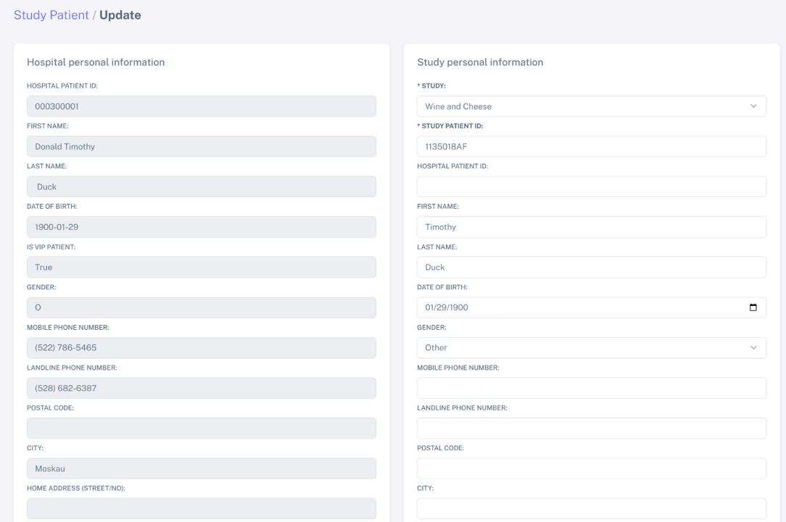
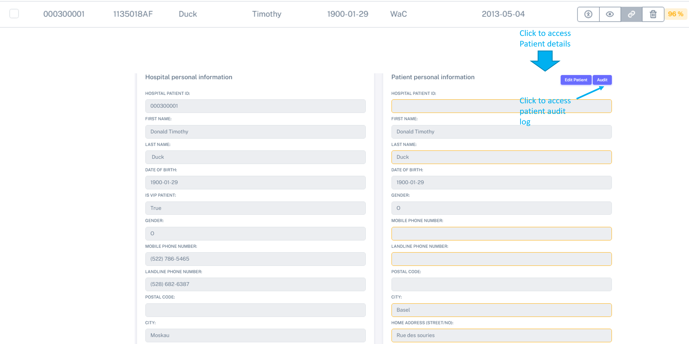
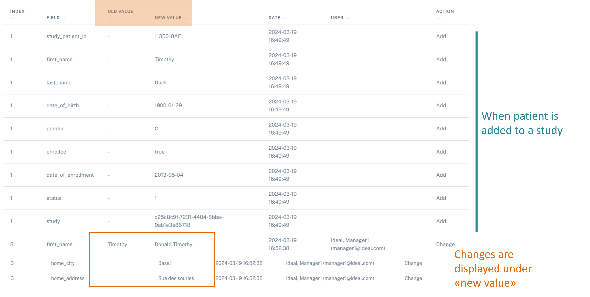

Audit log
############

The audit log tracks the any change which happen at the Study level. For example, if a patient's address is edited, this will be tracked.

First let's update a patient information:

Edit a patient information
****************************

Imagine Donald Timothy Duck was registered as Timothy Duck in the study "Wine and Cheese". As a study nurse, you realize this is a mistake and I want to correct this patient information.

For this, please navigate to **Patient management** > **Patient List (Study)** > **Edit patient**

.. image:: EditPatient.png

Here you can correct the information and maybe also update the address of this patient, as he notified you he had now moved to the "Rue des souries", and then **Save***.

You can see now see these changes and the audit log, by navigating to **Patient management** > **Patient List (Study)** > **Patient details**

 
And then select "Audit"                                                     

You can see some information of when the patient was imported (in blue) and the corrected data by comparing "Old Value" with "New Value"

Any new update will be recorded under "New Value", together with when and whom changed this information.
