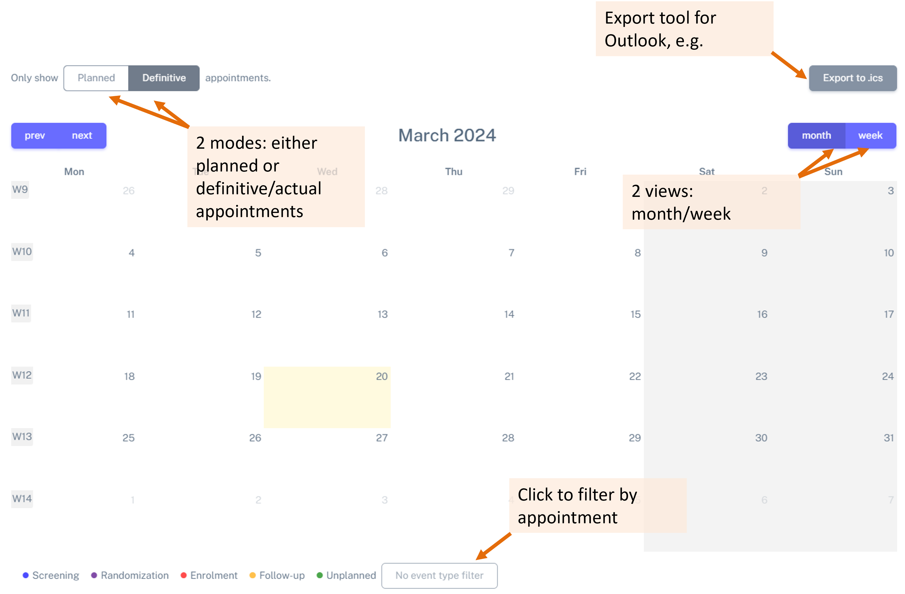
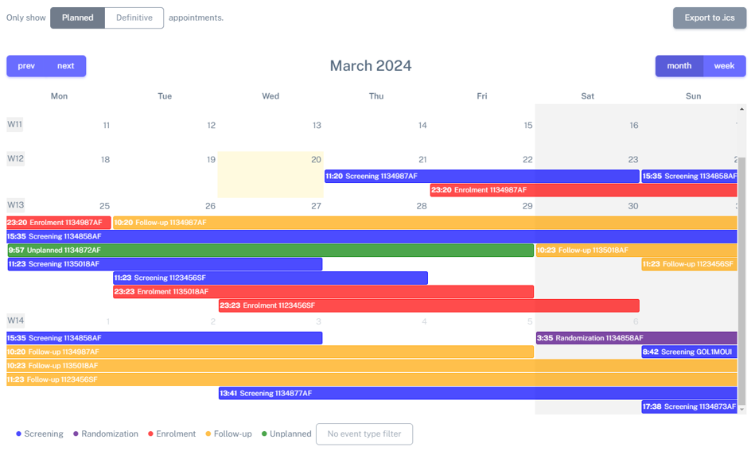
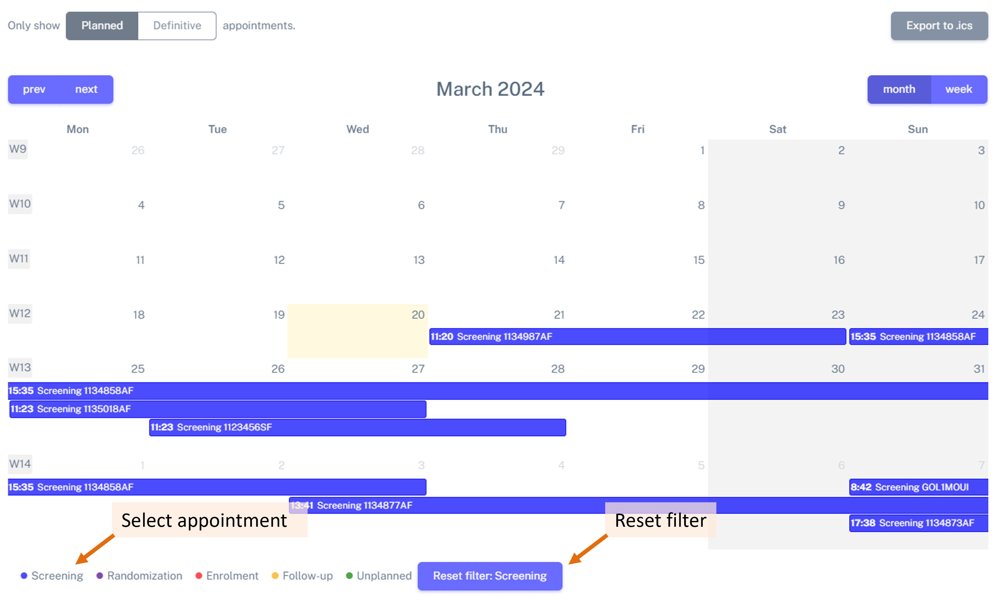
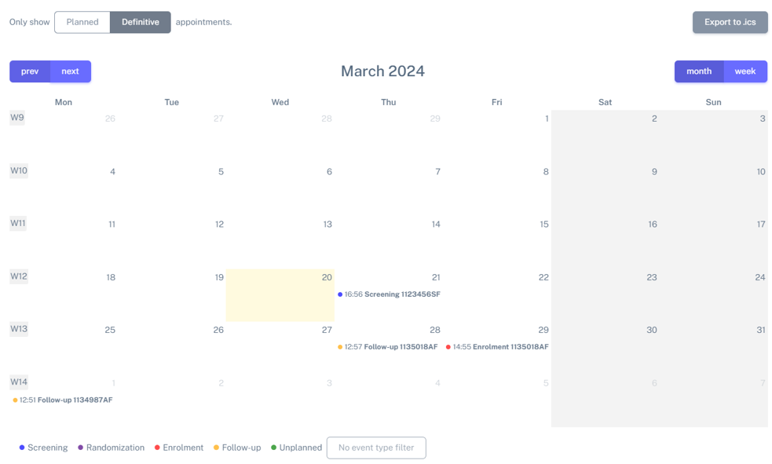
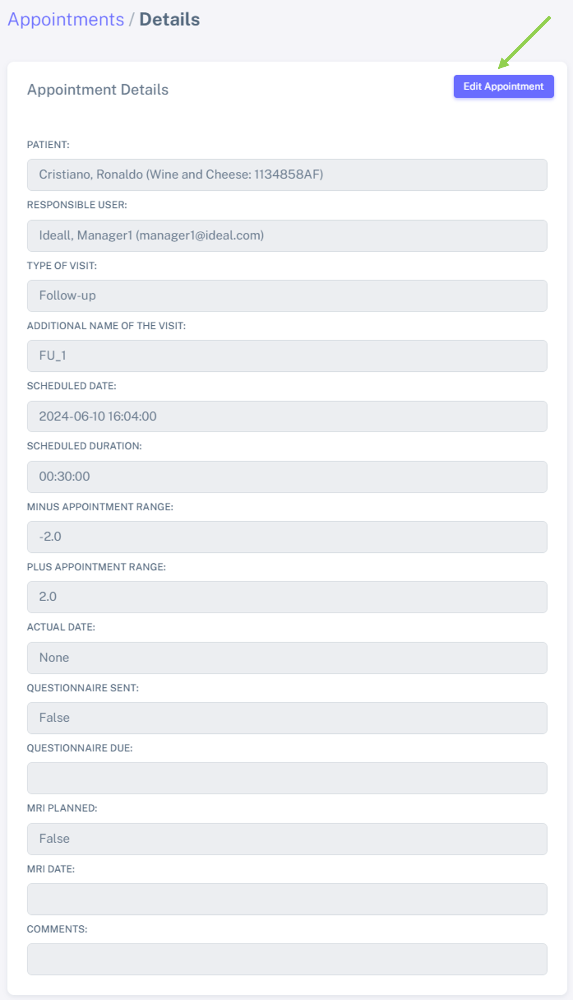
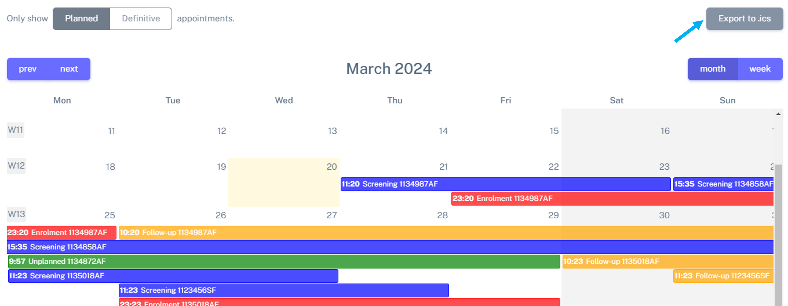
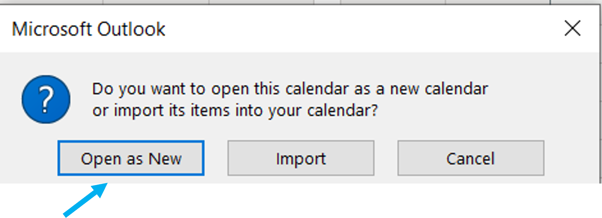

Calendar to view patient appointments 
##########################################

Calendar overview
*******************

.. note:: Filter the study that you want to see in the *Filter* menu on top of the page.

The calendar helps you visualizing and managing your patient appointnments.

To viusualize it, please navigate to: **Appointments** > **Appointments Calendar**.

Below, you can see a general overview of the calendar, and some of its features:

First, you see that there are 2 different views: *Planned* or *Definitive*:

Calendar overview - planned view
==================================

Select the *Planned* view on the top left corner of the calendar.

In this view, you can see the schedules/planned appointments and the respective range. The appointments are colour coded and the *Study ID* is indicated (this will be further updated to show the *patient name* instead).

.. note:: One important feature about the calendar: the calendar is set **per study**, i.e. anyone who is part of the study, has authorization to see the calendar.

You can filter by type of the appointment, as indicated in the figure (for example, selecting only *screening* appointments:

Calendar overview - definitive view
=======================================

By selecting the definitive view, you can see the definitive/actual appointments. The time of the appointment can be seen in the *week* view. The appointments are also colour coded and the *Study ID* is indicated (this will be further updated to show the *patient name* instead). You can equally filter by type of the appointment, as indicated in the figure (for example, selecting only *screening* appointments:

Managing your appointments via the calendar
=============================================

You can manage your appointments via the calendar by double-clicking in one appointment - this will open the *Appointment details* for this appointment.

Foe example, below, I double-clicked in a planned appointment for Cristiano Ronaldo, which now has a definitive date.

I will edit this appointment to register the actual appointment's date (11 of June 2024 in this case), by clicking on *Edit Appointment*, on the top right corner (green arrow).

When returning to the calendar view, in the *Planned* section, you can see that the appointment which has a definitive date has a more transparent colour (see green arrow):

.. image:: ColAppChange.png

.. tip:: The colour change provides an easy way to distinguish between appointments with and without a definitive date.

.. tip:: When a definitive date for an appointment is cancelled, the colour will revert from a transpartent to a bold shade.

Calendar export and import to another software
*************************************************

Select the study in the upper menu and then just select "**Export to .ics**" (blue arrow).

Open the downloaded file and select "**Open as new**", for example in the case of importing it to *Microsoft Outlook*.

.. note:: It is better to import this calendar as a "*New calendar*", instead of *importing* it directly to your own calendar - in case of mistake you can easily delete it and export it again.

