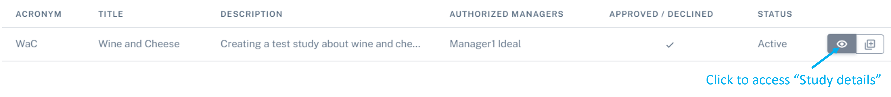

Study management: create, approve, edit and delete a study
################################################################

Create a new study
********************

To create a new study, select "**Studies**" on the sidebar navigation, and then "**Create Study**".

Here you can name your study, select an acronym and add a short description for your study.

.. note:: The items detailed with "*****" are mandatory when creating a study.

.. warning:: Avoid the use of special characters (for example, *, $, &, etc) when creating a study acronym, as it can affect some features on IDEAL (for example the viewing of the Appointment Schedules) - this is a known issue we are trying to fix.

A test study named "Test01" was created here as an example, as shown below.

.. image:: StudyTestCreated.png
   :width: 600

Please select the:

   * "**Authorized users**", who will be able to edit and manage patients from a study, but will not be able to edit the study.
   * "**Local responsible operators**", who will be able to manage users and edit the study.  "**Local responsible operators**" can also manage patients.

.. image:: UsersStudySelect.png

.. note::
   To select multiple users, please use the CTRL + left click button.

You can now click to save and create your study. Your study can now be seen in the "**Studies**" area, as seen below:

.. image:: WaitForSuperuser.png
   :width: 600

Now, your study needs to be approved by the Superuser. Check the next section to understand how to *Approve a new study*.

Approve a new study
********************

When logged in as Superuser, you will find the study to be approved in your "**Dashboard**":

.. image:: StudyApprovalSuperuser.png

Click on the "**✓**" to approve the study. Your study is then approved.

.. warning:: Only the IDEAL Superuser can approve the study. Until then, it is not possible to either import or add patients to the study.

Edit a study
********************

If you are an IDEAL **Manager** or **Superuser** (see :doc:`users` for more information), you have the right to edit a study by selecting this icon, on your "**Dashboard**" or "**Studies**">"**Create Study**":

.. warning::
   Any change on a Study will require re-approval from a Superuser.

.. note:: Hovering with the mouse over the icons will show you their functions.

Delete a study
********************

An IDEAL manager can delete a study before it has been approved by a Superuser. After the study has been approved, only the Superuser has the right to delete the study.

To delete a study just navigate to your "**Dashboard**" and select the appropriate icon as shown below:

.. image:: DeleteStudy.png

A message will appear for you to confirm this action.
