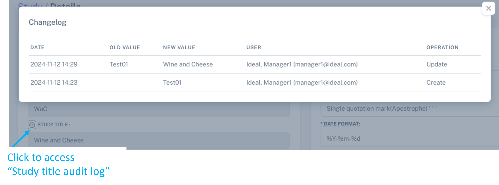
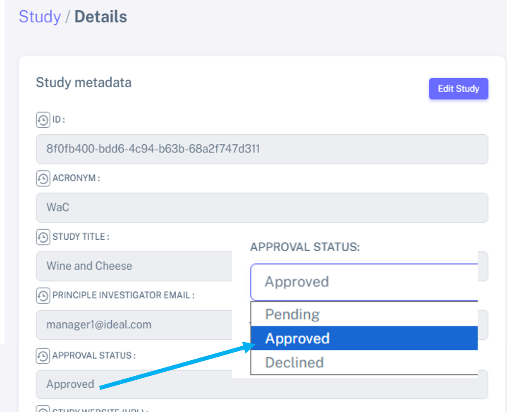

Study management: create, approve, edit and delete a study
################################################################

Create a new study
********************

To create a new study, select "**Studies**" on the sidebar navigation, and then "**Create Study**".

Here you can name your study, select an acronym and add a short description for your study.

.. note:: The items detailed with "*****" are mandatory when creating a study.

.. warning:: Avoid the use of special characters (for example, *, $, &, etc) when creating a study acronym, as it can affect some features on IDEAL (for example the viewing of the Appointment Schedules) - this is a known issue we are trying to fix.

A test study named "Test01" was created here as an example, as shown below.

.. image:: StudyTestCreated.png
   :width: 500

Please select the users who will be able to access the study later on:

 * “Authorized managers”: these users have the role of managers. These can manage the patients and modify the study details.
 * “Authorized users”: these users have the role of users. They can manage the patients but cannot modify the study details.

At least one user from one of the categories needs to be selected.

.. image:: UsersStudySelect.png
   :width: 500

.. note::
   To select multiple users, please use the CTRL + left click button.

Once the study is saved, it will appear in the “**Studies**” area, as seen below: 

.. image:: WaitForSuperuser.png

The first time a study is created, it needs the approval of the superuser. This approval process by the superuser is detailed in the next section. 

Approve a new study - only for Superusers
***********************************************

Only the Superusers can approve a new study. 

When a Superuser is logged in into their session, the to-be-approved study can be found the study to be approved in your “Dashboard”: 

.. image:: StudyApprovalSuperuser.png

Click on the "**✓**" to approve the study. Your study is then approved.

.. warning:: Only the IDEAL Superuser can approve the study. Until then, it is not possible to either import or add patients to the study.

Edit a study
********************

If you are an IDEAL **Manager** or **Superuser** (see :doc:`users` for more information), you have the right to edit a study by selecting this icon "Study details", on your "**Dashboard**" or "**Studies**" > "**Study Lists**":

.. image:: EditStudy.png

Audit log at study level
==============================

From here, click on "Edit Study" on the top right (see orange square in figure below). Once you save your changes (by selecting "Save" at the bottom of the "Edit Study" menu), you can check the changes which were made at any time by clicking the icons with the blue arrows. For example, the "Test01" study was changed to "Wine and Cheese" (and the acronym "TT" to "WaC").

When you click on the icon next to "Study title" you can see these changes, as demonstrated below:

At the bottom of the Study Details (just scroll down). A summary of changes at patient level is shown - for example if a patient has been deleted or updated.

.. note:: Hovering with the mouse over the icons will show you their functions.

Add patients to a study - only for Users or Managers
**********************************************************

There are 2 ways to add patients to your study: 

1. bulk import of a pre-existing patient list (if the study is ongoing and you have been maintaining the patient list outside IDEAL) - find more details :ref:`here <BulkRef>`
2. add new patients directly from the hospital database (newly created study, in which the patient list is directly generated in IDEAL) - find more details :ref:`here <AddPatientRef>` 

.. note:: Once a patient list is added to IDEAL, you can add *new* patients by selecting them directly from the hospital database.

Block a study - only for Superusers
******************************************

The Superuser has the right to block a study, which temporarily revokes access to its patient data (this is a reversible feature).

For this, go to **Studies** > ** Studies List**, and then select "Study's detail" by clicking on the "eye" icon in front of the study. Then, select "Edit Study" and change the *Approval status* to "Declined".

Delete a study
*****************

An IDEAL manager can delete a study before it has been approved by a Superuser. After the study has been approved, only the Superuser has the right to delete the study.

To delete a study just navigate to your "**Dashboard**" and select the appropriate icon as shown below:

.. image:: DeleteStudy.png

A message will appear for you to confirm this action.
