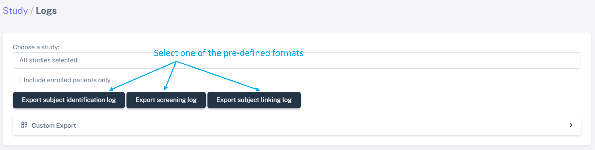
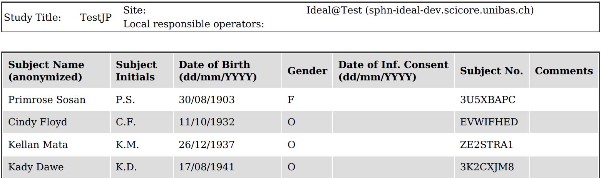
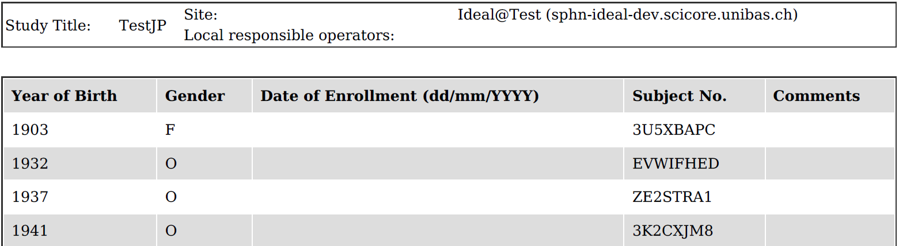
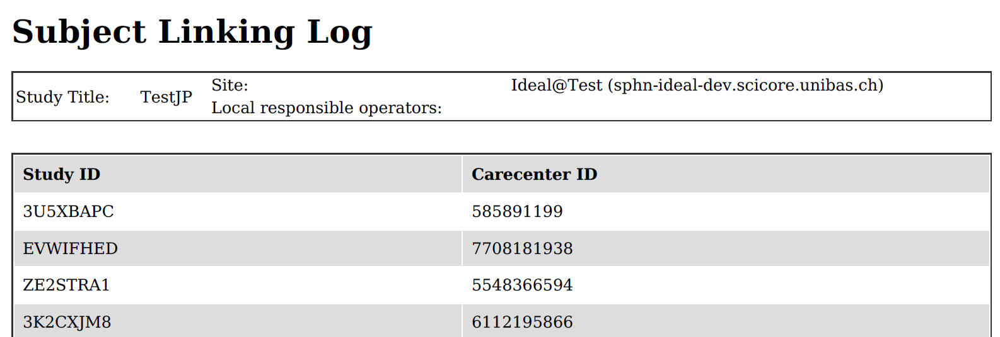
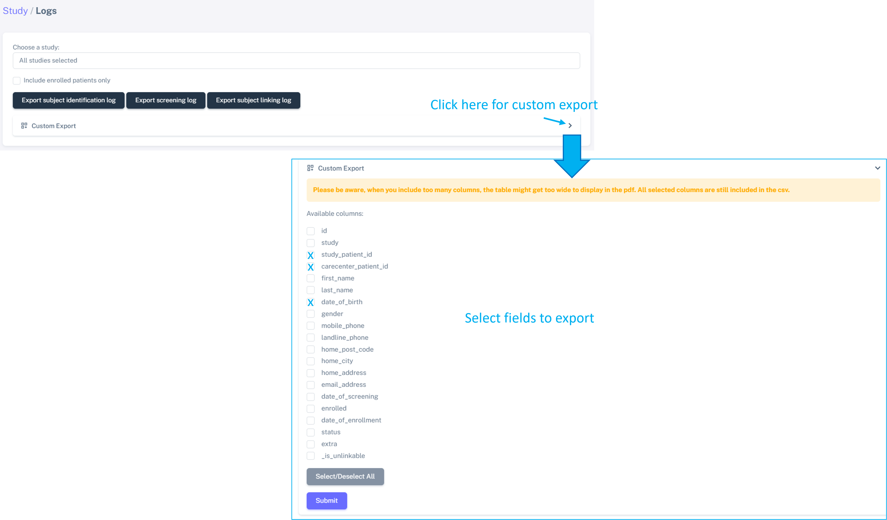

Export of pre-defined or customized files
###############################################

Currently only an **IDEAL manager** and **IDEAL user** can export the log files.

Go to "**Studies**" > "**Log file export**". Here, and after selecting the study, you can choose to export either pre-defined log files or create a custom export tailored to your needs.

.. note:: Files in 2 different formats are generated: .pdf and .csv

..note:: It is also possible to export appointments in either a list (.pdf and .csv) or calendar format (.ics), this is explained in this :ref:`section <ExpAppRef>`.

Export pre-defined log files
*******************************

After selecting the study, you can easily export the pre-formatted files by selecting one of the options, as shown below:

There are 3 types of log files which can be exported (an example of each file is shown below):

1) Subject identification log
--------------------------------

   
2) Screening and enrollment log
--------------------------------

3) Subject linking log
--------------------------------

Export customized log files
*******************************

It is also possible to customize the export file, by following the steps shown below:

