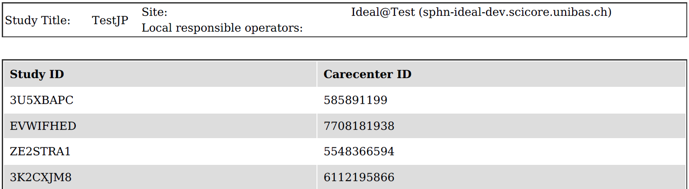

File export
##############

Currently only an **IDEAL manager** and **IDEAL superuser** can export the log files.

To export the log files go to "**Studies**" and then "**Log file export**".

.. note:: Files in 2 different formats are generated: .pdf and .csv

There are 3 types of log files which can be exported (an example of each file is shown below):

1) Subject identification log
--------------------------------

.. image:: SubjectIdentification.png
   
2) Screening and enrollment log
--------------------------------

3) Subject linking log
--------------------------------

