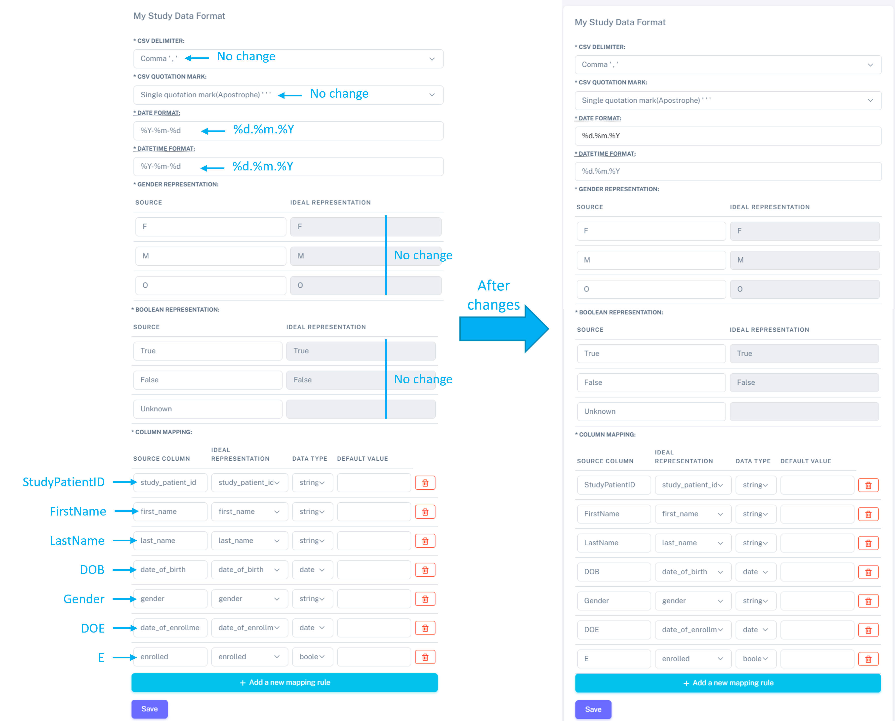

Import study patients - bulk import from a CSV file
=============================================================================================================

Define the data format of a study
***********************************

Before importing the patients of your study, you need to check the study details. For this, click on the *eye* icon on the bar, in front of your study (either from the **Dashboard** or **Studies** > **Studies List**).

Here you will have access to the "**Study metadata**" and "**My Study Data Format**". This last section is especially important before the bulk import of the patient data from your study, as it allows to match the format of your study data (column names, date format, etc) to the format IDEAL "expects". The format of your data will be "**Source**" and what IDEAL "expects" would be "**IDEAL representation**". 

.. warning:: To bulk import patients, IDEAL only supports .CSV files at the moment. Most programs (for example MS Excel) supports conversion into a .CSV format.

Let's take this dummy file as an example: 

.. image:: PatientsFake.png

It contains the information of 3 "patients". This is a CSV file with the follwing columns:

   * StudyPatientID: patient identification number
   * FirstName: first name of the patient
   * LastName: surname of the patient
   * DOB: date of birth
   * Gender: gender
   * DOE: date of enrollment
   * E: whether the patient is enrolled 

.. warning:: Disclaimer: these "patients" are fake "patients", who were created to explain this section and are not enrolled, as far as we know, in any kind of real study.

Let's go step by step, taking the above data as example. In IDEAL, in the "**My Study Data Format**", you can see the following fields:

   - "CSV delimiter": here choose what is the separator used on your file
      * our study is already separated by "," - no change required
   * "CSV quotation mark": here choose the appropriate quotation mark
      * our study is already separated by "," - no change required
   * "Date format": default is set to %Y-%m-%d (format specifier). This means that IDEAL expects the date in the following format: YYYY-mm-dd (for example: 2023-08-01).
      * our data has a different date format: dd.mm.YYYY (or %d.%m.%Y) - this needs to be updated: just add the “Date format” and “Datetime format”
   * "Gender representation": IDEAL representation of Female is defined by "**F**", Male by "**M**" and "**Other**" to "**O**".
      * in our study, the gender is also set to "**F**" and "**M**" - this does not need to be updated.
   * "Boolean representation": here IDEAL expects the value True/False
      * in our study, the boolean values for **enrolled** are also described as True/False - this does not need to be updated
   * "Column mapping": here we need to match the names of our columns to the IDEAL representation. Here the default source columns need to be updated to match the names of our columns, as they are currently set to the same as the IDEAL representation:
      * study_patient_id
      * first_name
      * last_name
      * date_of_birth
      * gender
      * date_of_enrollment
      * enrolled

You can see here the different changes on "**My Study Data Format**" that need to be done (on the left), and then after the changes (on the right):

Your study format has been set and you can "**Save**".

.. note:: You will need to specify the study format before importing the patient data. You can also format your data to match the default IDEAL.

.. warning:: If a mismatch between the source (your study) and IDEAL formats occurs, the patient bulk import to IDEAL will fail.

.. warning:: Every time a new study is created, the source will reset to the default mentioned above. Therefore, every time a new study is created, the Study data format will have to be specified.

Import a list of patients from a CSV file
*********************************************

To import a list of patients from an ongoing study, select "**Import**" in the "**Patients**" area:

.. image:: ImportStudy.png

.. warning:: Before importing the list of patients, first make sure you are trying to import a .CSV file and that this file follows the data format defined on IDEAL (see above how to do this).

Here, select the study you want to import patients to and select the CSV file which contains the Study patients.

Your Study patients will be automatically linked and matched to the Hospital database!

Check the section :doc:`linkage` to understand more about the linkage process on IDEAL and how to further manage the patients in your study!

.. warning:: Confirm the format and the name of your columns matches the format expected by IDEAL!
