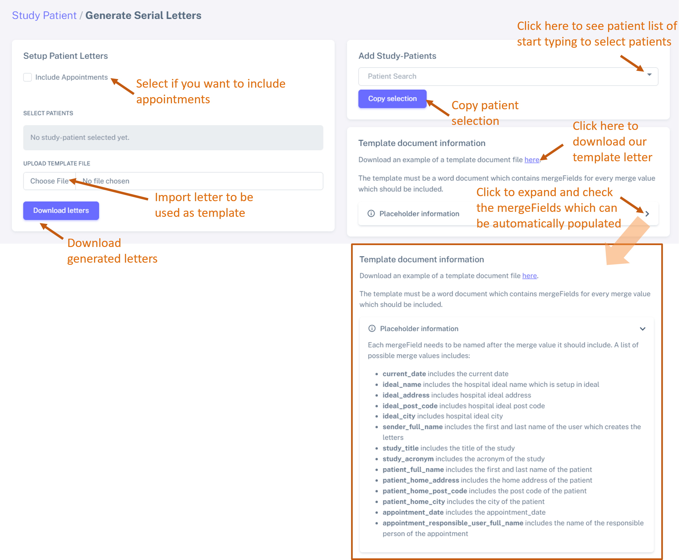
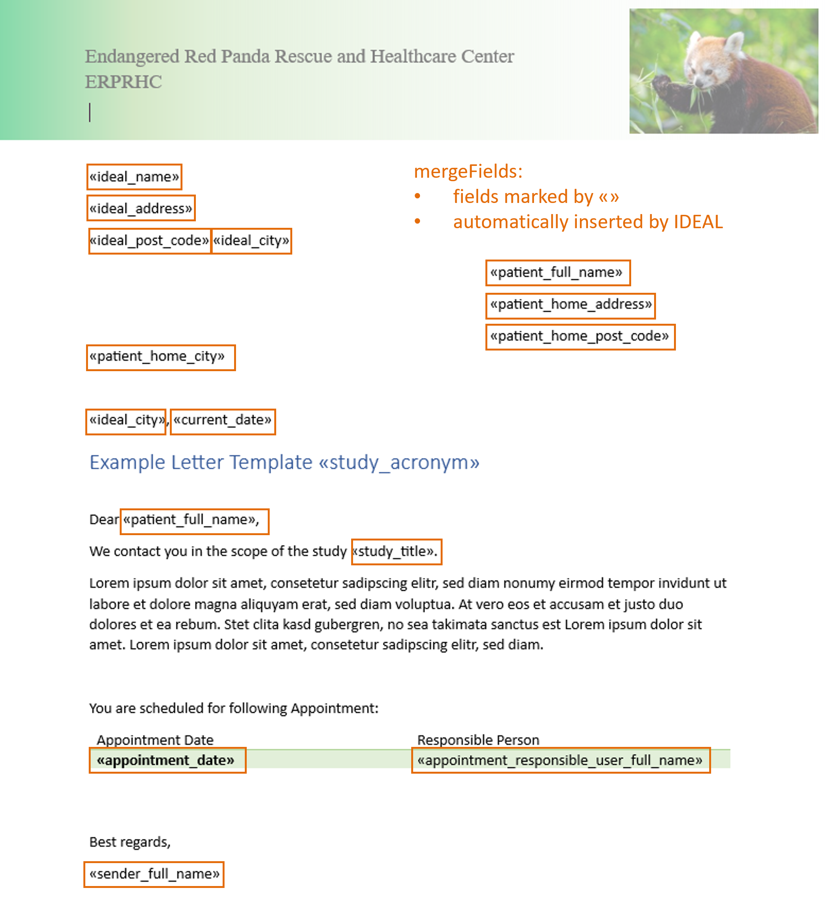
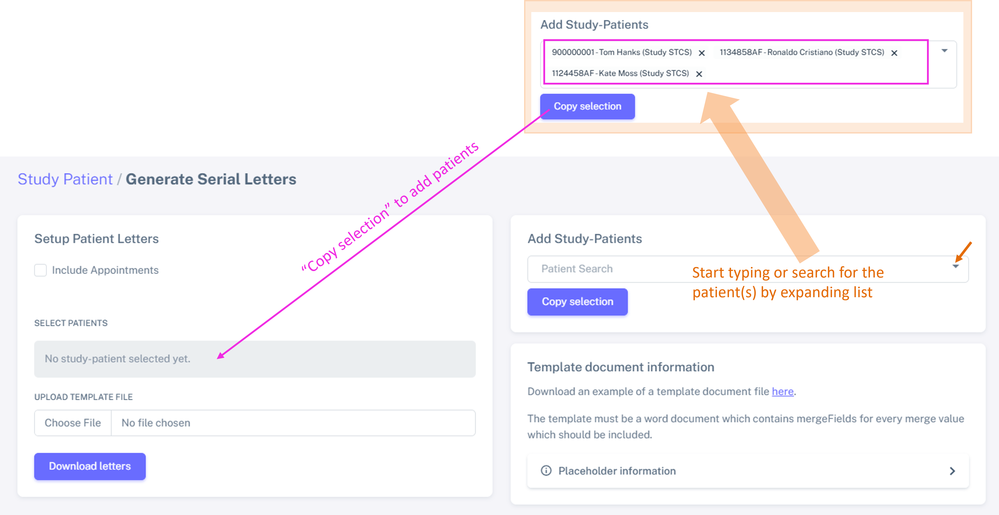
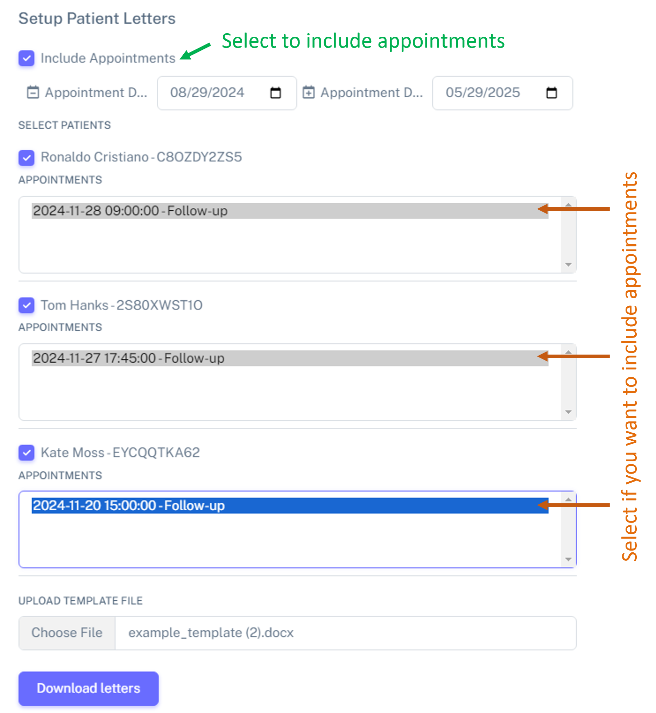

.. _LetterRef:

Generate serial letters based on a template letter
########################################################################################################

This section enables you to generate serial letters using a customizable template. Simply import your template, and IDEAL will automatically personalize each letter with relevant details from the database, for multiple patients, facilitating bulk communication to patients, medical staff, etc.

We offer a :ref:`customizable template letter <TempRef>` that you can easily edit and use to generate personalized serial letters.

How to access
*****************

You can access the section of letter creation by either:

* Navigate to: **Patient management** > **Create Letter**, or
* Navigate to: **Patient management** > **Patient lists (Study)** > Select patients > **Batch operations**.
* Navigate to: :ref:`Patient dashboard <PatDashRef>`, search for the patient and then select the "container" *Create Letter*. This patient will be automatically selected.

Section overview
********************

The figure below shows an overview of the user interface. Here you can see what you can do in each section.

We recommend the following work flow:

1. Check the instructions on how to generate a :ref:`template letter <TempRef>` (compatible with IDEAL) - or adapt the example template we provide (see section *Template document information*).
2. Add study patients as shown in the :ref:`section below <AddLetterRef>`.
3. Once your template letter is ready, please import it in the section *Setup Patient Letters* below *Upload template file*.
4. If you want to generate serial letters based on Appointments booked in IDEAL, please check the box *Include Appointments*.

.. _TempRef

Customizable template letter
********************************

We provide an example of a template letter (as a .docx document) which can be customized as you please.

Example of a template document
=====================================

Below is an example of a template letter we provide, available for download. This .docx document is fully customizable and includes pre-set merge fields (highlighted in orange), which IDEAL can automatically read and populate with relevant data.

.. warning:: Please do not change the names or format of the provided merge fields, as this may disrupt the proper integration of data from IDEAL. However, you are free to move them to different locations within the document.

.. _AddLetterRef

Select patients
********************************

You can select the patients either by typing the name of the patient or by expanding the list of study patients (see section *Add Study-Patients*). Once selected, they will appear under the *Setup Patient Letters* section, within *Select Patients*, as illustrated in the figure below.

.. tip:: When managing multiple studies, you can use the filter at the top of the page to quickly and easily select the patient list for a specific study.

Generate serial letters based on appointments
***************************************************

If you want to send serial letters based on appointments, check the box *Include appointments*.

Then select again which appointments you want to include, as shown below:

.. warning:: Only **booked** appointments will be added to the template letters.
