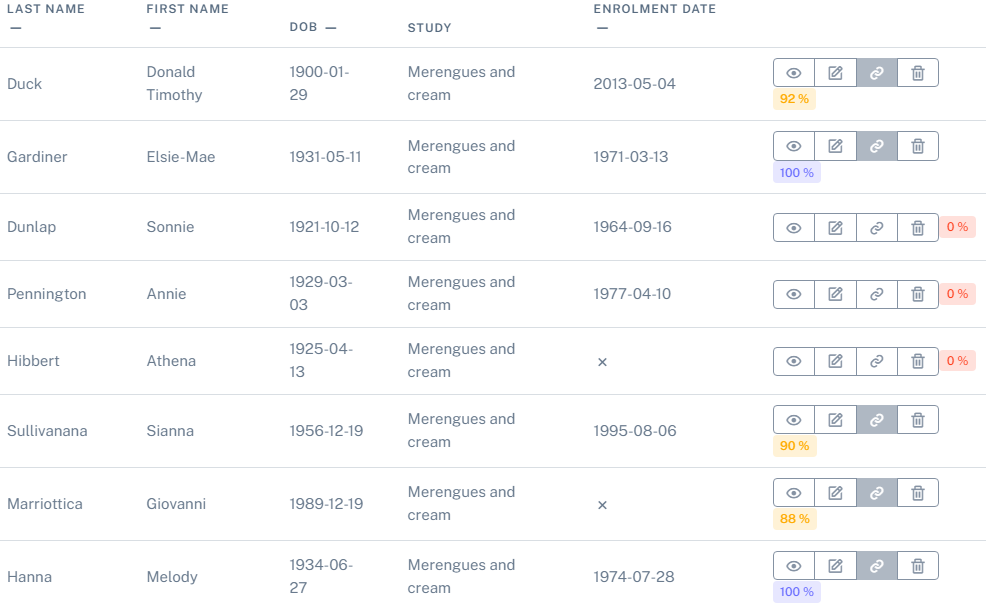
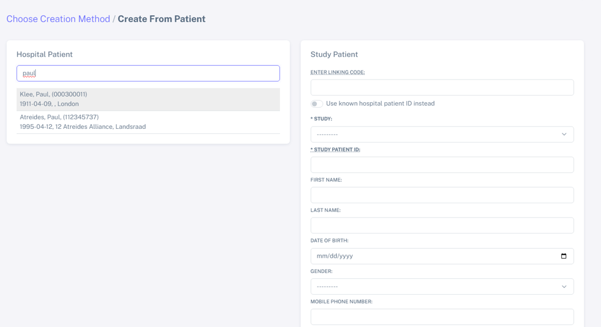
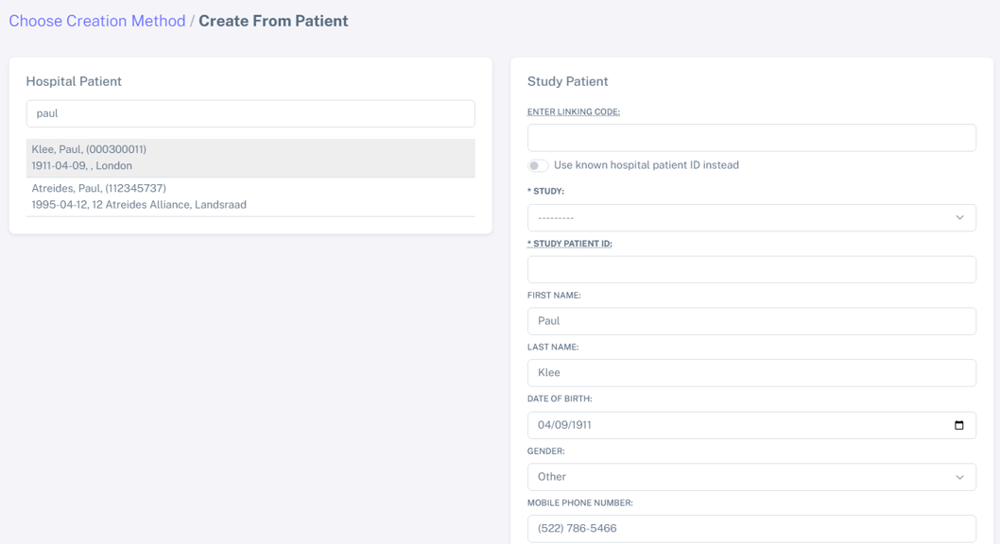

Study overview after patient import and IDEAL linkage
#######################################################

Linkage
*********

After bulk import of your study patients (see :doc:`study`), IDEAL will automatically link the patients from your study with the patients from the hospital.

.. image:: Linkage.png

Here for example, 100 patients were imported and from these, 80 had an immediate match with the hospital patients, while 14 "similar pairs" were linked.

"Similar pairs" likely have some similarity conflicts, but were still close enough to be considered a match.

We will look at some examples of "similar pairs" below, but first let's navigate to our study and have an overview of the patients.

.. warning:: If you get an error message when importing your patients to a study, please check either this section :doc:`trouble` or this :doc:`study`.

.. note:: The linkage in IDEAL works by using an alghoritm to calculate the similarities between the patient information between the Study CSV and the Hospital. The more information provided, the more information to compare and the more accurate will it be!

Study overview after linkage
******************************************************

By navigating to the area "**Patients**" and then to "**Patients List**", you can see here the patients which were imported to your study (in my case the study "Merengues and Cream").

.. image:: LinkOverview.png

When hovering over the different icons on the right, you can see different functions - see below.

.. image:: Icons.png
   :width: 400 

.. note::
   For a linked patient, the icon "**Link patient**" will be displayed in gray, while a non-linked patient will be displayed in white.

Linkage based on similarity score
******************************************************

The linkage in IDEAL is performed via a similarity score calculation, calculated by a PPRL algorithm. In simple words, the patient information from the Hospital is compared with the Study list information, a score is calculated based on this similarity, and patients are matched if the similiarity score is above 85% (set as default). Because of this, IDEAL allows a small degree os mismatch (see section below).

.. note::
   Note how the similarity is colour coded: red corresponds to no linkage, yellow to not perfect linkage, blue to a perfect linkage. The similarity score value is also displayed.

..note::
  The similarity score is periodically updated upon an update on the hospital patients.

Examples of linkage of "similar pairs"
******************************************

* Example 1:
----------------

In this case, this patient has been recorded in the hospital database with two first names "Donald Timothy", while in the study he was introduced as only "Timothy".

.. image:: Duck.png

However, because the rest of the information (surname, date of birth) is the same, the similarity is good enough for IDEAL to link them as a pair.

* Example 2:
-------------

Similarly in the case below, the patient "Jennyfer Vengerberg" had been recorded as only "Jen" instead of "Jennyfer" in the study. As the rest of the information is the same, this patient was still correctly linked.

.. image:: Jen.png

* Example 3:
----------------

In this case, someone made a mistake while writing the name in the study and wrote "Viri" instead of "Ciri". IDEAL still manages to match this patient to the right patient in the hospital database, as the rest of the information is correct.

Examples of no linkage 
*******************************

After bulk import of study patients, you can check the patients which were not linked by navigating from "**Patients**" and then to "**Patients List**", and selecting here "**Unlinked**" in the dropdown menu, as shown below:

.. image:: Unlinked.png

In my case, there were 6 patients which were not linked to the hospital database.

.. image:: Unlinked2.png

As this is dummy data which I have prepared, I know that the 3 first patients (Sonnie Dunlap, Annie Pennigton and Athena Hibbert) are not patients at this hospital, and therefore cannot be linked by IDEAL.

Let's look at the example "Geralt Whitewolf" and let's try to link it by selecting the "link" symbole as indicated below with the arrow:

.. image:: G1.png

Then you can search on the "**Carecenter Patient**":

.. image:: G2.png

Indeed there is a patient called "Geralt Whitewolf", which could be the right patient. Select this patient and then select "**Choose patient**". The following window is displayed, showing the information in the Hospital database on the left and the information in the Study on the right:

As you can see in the figure, the date of birth and the gender are different in both databases, so despite having the same name, these patients are likley not be the same person. In this case, I would consider these "Geralt Whitewolf" to be different people and would not "**Confirm**" and linked them.

Edit a patient from the study
*******************************

Sometimes errors might be introduced when creating the CSV file with the Study patients. This is the case of the example below: 

.. image:: WrongDOB.png

This dummy patient called Elsie-Mae Gardiner had the wrong year of birth on the study file (1931 instead of 1930). 
In order to update the Study details, you can navigate to "**Patients**" and then to "**Patients List**". Here you can use this icon in the same row as the patient you want to edit, as shown below:

.. image:: EditPatientIcon.png

And make your changes as shown below as well (in the Study table, and don't forget to **Save**):

.. note:: Note how Elsie-Mae Gardiner still got linked by IDEAL despite the small change in the year of birth (all the other information was the same)!

.. warning:: Before updating any patient information make sure that this information is correct!

Check the patient list of the hospital
****************************************

To check the patient list of the hospital centre, please navigate to "**Patients**", and then to "**Create patient**".

Add a patient to a running study
**************************************

Now let's try to add a new patient to a already running study (TJP100). You can do this by adding these patients manually be searching on the patient list from the hospital as mentioned above. For this, please navigate to "**Patients**", and then to "**Create patient**". 

Here, search the patient you want to add in "**Carecenter Patient**", as shown below for the patient "Paul Klee".

.. note:: In this search area, you have access to the patients in the Hospital. In order to search for these patients, IDEAL has to be connected to the Hospital database and will be regularly updated.

When selecting "Paul Klee" (just by right clicking on it), the patient information available in the hospital database will be automatically "added" to the "Study patient" field, as shown below.

Here you will have to select the "**Study**" to which you'll be adding this patient, and add the "**Study Patient ID**". 

Then by scrolling to the bottom of the page, select "**Save**" and the patient is added to the study and will appear in the "**Patients List**".

.. warning:: Remember that not all IDEAL users are able to search for patients in the Hospital database. Check more information on :doc:`users`.
