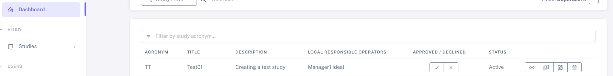

Worflow: manage a new study - by directly adding patients from the hospital database
#######################################################################################

Create a new study
********************

To create a new study, select "**Studies**" on the sidebar navigation, and then "**Create Study**".

Here you can name your study, select an acronym and add a short description for your study.

.. note:: The items detailed with "*****" are mandatory when creating a study.

A test study named "Test01" was created here as an example, as shown below.

.. image:: StudyTestCreated.png
   :width: 600

Please select the:

   * "**Authorized users**", who will be able to edit and manage patients from a study, but will not be able to edit the study.
   * "**Local responsible operators**", who will be able to manage users and edit the study.  "**Local responsible operators**" can also manage patients.

.. image:: UsersStudySelect.png

.. note::
   To select multiple users, please use the CTRL + left click button.

You can now click to save and create your study. Your study can now be seen in the "**Studies**" area, as seen below:

.. image:: WaitForSuperuser.png

Now, your study needs to be approved by the Superuser. Check the next section to understand how to *Approve a new study*.

Approve a new study
********************

When logged in as Superuser, you will find the study to be approved in your "**Dashboard**":

Click on the "**✓**" to approve the study. Your study is then approved.

.. warning:: Only the IDEAL Superuser can approve the study. Until then, it is not possible to either import or add patients to the study.

Delete a study
********************

An IDEAL manager can delete a study before this has been approved by a Superuser. After the study has been approved, only the Superuser has the right to delete the study.

To delete a study just navigate to your "**Dashboard**" and select the appropriate icon as shown below:

.. image:: DeleteStudy.png

A message will appear for you to confirm this action.

Edit a study
********************

If you are an IDEAL **Manager** or **Superuser** (see :doc:`users` for more information), you have the right to edit a study by selecting this icon, on your "**Dashboard**" or "**Studies**">"**Create Study**":

.. image:: EditStudy.png

.. warning::
   Any change on a Study will require re-approval from a Superuser.

.. note:: Hovering with the mouse over the icons will show you their functions.

Add a patient to an ongoing study
**************************************

Now let's try to add a new patient to a already ongoing study (Merengues and Cream, for example). You can do this by adding these patients manually be searching on the patient list from the hospital as mentioned above. For this, please navigate to "**Patient management**", and then to "**Add patient to a study**".

Here you will be prompted to add a patient either from the local Hospital/Carecenter or add this patient manually.

Here, search the patient you want to add in "**Hospital Patient**", as shown below for the patient "Paul Klee".

.. image:: PKlee.png

.. note:: In this search area, you have access to the patients in the Hospital. In order to search for these patients, IDEAL has to be connected to the Hospital database and will be regularly updated.

When selecting "Paul Klee" (just by right clicking on it), the patient information available in the hospital database will be automatically "added" to the "Study patient" field, as shown below.

.. image:: PKlee2.png

Here you will have to select the "**Study**" to which you'll be adding this patient, and add the "**Study Patient ID**". 

Then by scrolling to the bottom of the page, select "**Save**" and the patient is added to the study and will appear in the "**Patients List**".

.. warning:: Remember that not all IDEAL users are able to search for patients in the Hospital database. Check more information on :doc:`users`.
