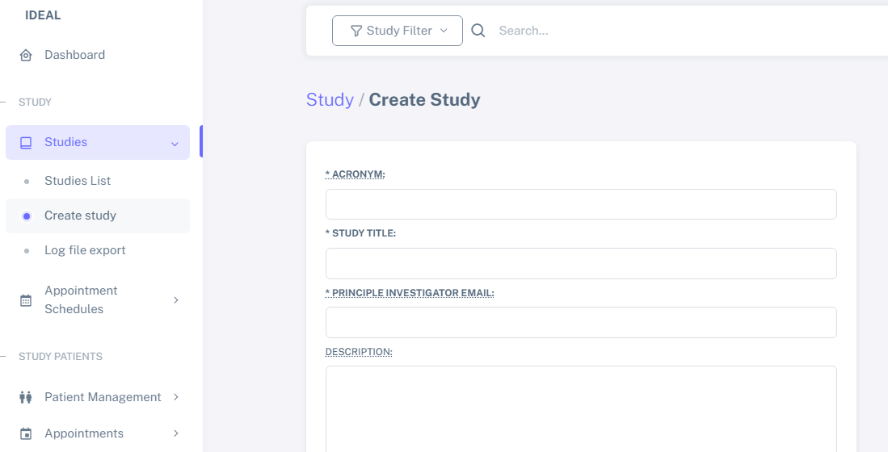

Study area
####################

Create a new study
********************

To create a new study, select "**Studies**" on the sidebar navigation, and then "**Create Study**", as shown below:

Here you can name your study, select an acronym and add a short description for your study.

.. note::
   The items detailed with "*" are mandatory when creating a study.

A test study named "Test01" was created here as an example, as shown below.

.. image:: StudyTestCreated.png

It is important to define who will be the:
   * "**Authorized users**", who will be able to edit and manage patients from a study, but will not be able to edit the study.
   * "**Local responsible operators**", who will be able to manage users and edit the study.  "**Local responsible operators**" can also manage patients.

.. image:: UserStudySelect.png

.. note::
   To select multiple users, please use the CTRL + left click button.

You can now click to save and create your study. Your study can now be seen in the "**Studies**" area, as seen below:

Approve a new study
********************

Now, your study needs to be approved by the Superuser.

When logged in as Superuser, you will find in your "**Dashboard**" the study to be approved:

.. image:: StudyApprovalSuperuser

.. warning:: Only the IDEAL Superuser can approve the study. Until then, it is not possible to either import or add patients to the study.

 

You can check your study details here

Define study details (file specs)
***********************************

Edit a study
********************

Import study patients
***********************
