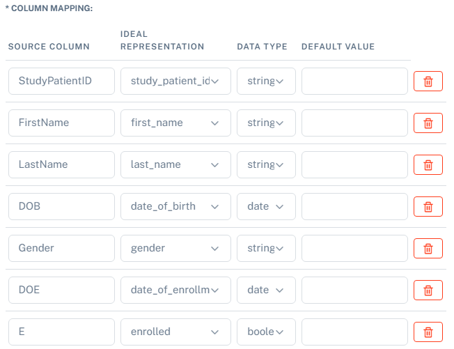

Study area
####################

Create a new study
********************

To create a new study, select "**Studies**" on the sidebar navigation, and then "**Create Study**".

Here you can name your study, select an acronym and add a short description for your study.

.. note::
   The items detailed with "*****" are mandatory when creating a study.

A test study named "Test01" was created here as an example, as shown below.

Please select the:
   * "**Authorized users**", who will be able to edit and manage patients from a study, but will not be able to edit the study.
   * "**Local responsible operators**", who will be able to manage users and edit the study.  "**Local responsible operators**" can also manage patients.

.. note::
   To select multiple users, please use the CTRL + left click button.

You can now click to save and create your study. Your study can now be seen in the "**Studies**" area, as seen below:

.. image:: WaitForSuperuser.png

Now, your study needs to be approved by the Superuser. Check the next section to understand how to *Approve a new study*.

Approve a new study
********************

When logged in as Superuser, you will find the study to be approved in your "**Dashboard**":

.. image:: StudyApprovalSuperuser.png

Click on the "**✓**" to approve the study.

.. warning:: Only the IDEAL Superuser can approve the study. Until then, it is not possible to either import or add patients to the study.

 Now your study has been approved.

Edit a study
********************

If you are an IDEAL Manager or Superuser (see :doc:`users` for more information), you have the right to edit a study by selecting this icon, on your "**Dashboard**" or "**Studies**">"**Create Study**":

.. image:: EditStudy.png

.. warning::
   Any change on a Study will require re-approval from a Superuser.

.. note::
   Hovering with the mouse over the icons will show you their functions.

Define data format of a study
***********************************

Before importing the patients of your study, you need to check the study details. For this click on the *eye* icon on the bar:

.. image:: IconsStudyDetails.png

Here you will have access to the "**Study metadata**" and "**My Study Data Format**". This last section is especially important before bulk import of the patient data from your study, as it allows to match the format of your study data (column names, date format, etc) to the format IDEAL "expects". The format of your data will be "**SOURCE**" and what IDEAL "expects" would be "*IDEAL REPRESENTATION**". 

.. warning::
   To bulk import patients, IDEAL only supports .CSV documents at the moment. Most programs (for example MS EXCEL) supports  conversion into .CSV.

Let's take this dummy file as an example: it contains the information of 3 "patients". This is a CSV file with the follwing columns:

   * StudyPatientID: patient identification number
   * FirstName: first name of the patient
   * LastName: surname of the patient
   * DOB: date of birth
   * Gender: gender
   * DOE: date of enrollment
   * E: whether the patient is enrolled 

.. warning::
    Disclaimer: these "patients" are fake "patients", who were created to explain this section and are not enrolled, as far as we know, in any kind of real study.

Let's go step by step, taking the above data as example. In IDEAL, in the "**My Study Data Format**", you can see the following fields:

   - "**CSV delimiter**": here choose what is the separator used on your file
      * our study is already separated by "," - no change required
   * "**CSV quotation mark**": here choose the appropriate quotation mark
      * our study is already separated by "," - no change required
   * "**Date format**": default is set to %Y-%m-%d (format specifier). This means that IDEAL expects the date in the following format: YYYY-mm-dd (for example: 2023-08-01).
      * our data has a different date format: dd.mm.YYYY (or %d.%m.%Y) - this needs to be updated
   * "**Gender representation**": IDEAL representation of Female is defined by "**F**", Male by "**M**" and "**Unknown**" to "**O**". Here the source default is pre-set to "Female", "Male", "Unknown", respectively to the IDEAL representation.
      * in our study, the gender is also set to "**F**" and "**M**" - this needs to be updated. This file is too short to understand how "**Unknown**" is set to, so we will set it as **U** for now.
   * "**Boolean representation**": here IDEAL expects the value True/False, while the source default is set to Ja/Nein/Unknown,
      * in our study, the boolean values for **enrolled** are also described as True/False - this needs to be updated
   * "**Column mapping**": here we need to match the names of our columns to the IDEAL representation. Here the default source columns need to be updated to match the names of our columns, as they are set to the same as the IDEAL representation:
      * study_patient_id
      * first_name
      * last_name
      * date_of_birth
      * gender
      * date_of_enrollment
      * enrolled

After the updates mentioned above, IDEAL looks like this:

   

Import study patients
***********************
