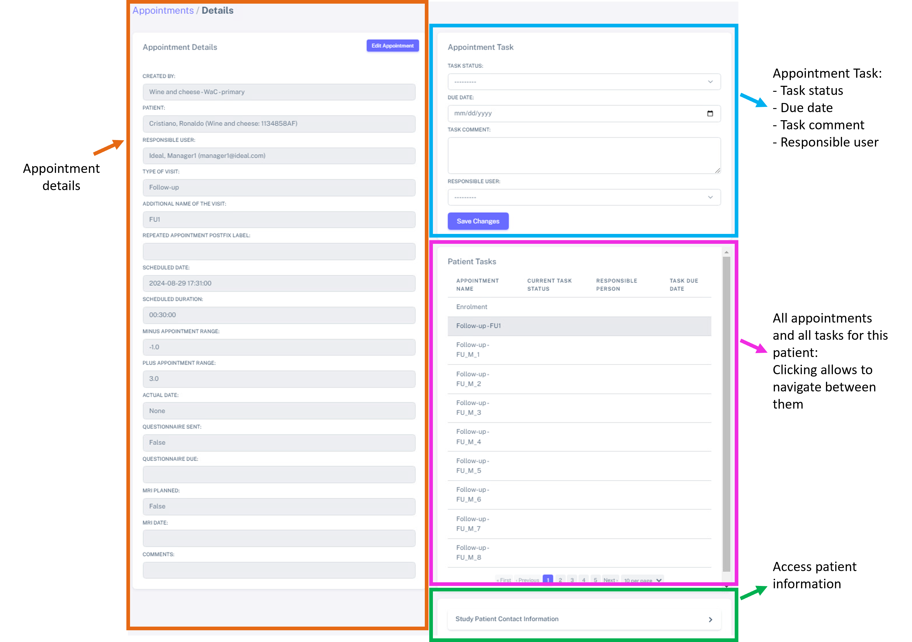
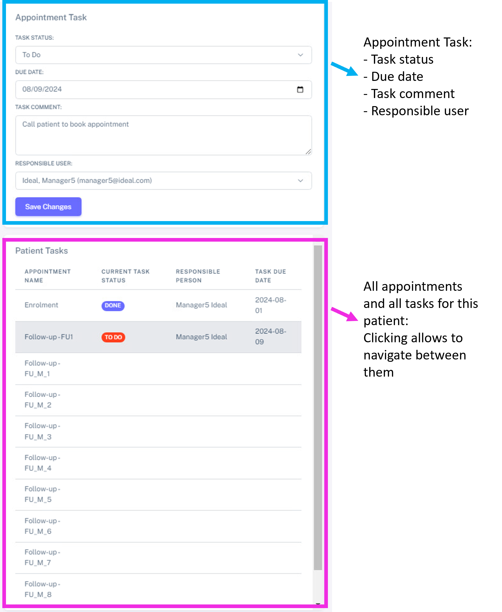

Tasks to manage appointments
###############################

Creating appointments automatically creates an associated task
*******************************************************************

When a patient appointment is created, a task is automatically created per each appointment. *Tasks* help manage the appointments and keep track of the different tasks, for example, call the patient to confirm the appointment, discuss with the doctors which exams need to be performed upon the visit, etc. You can also keep track of the appointment status (*to do*, *in progress* and *done*).

Therefore, a task will be displayed associated to a specific appointmnet:

Again, you can see each task will show associated with a specific appointment.

The task *specific for each appointment* is shown in the top right corner (blue blox): here, you can set the status of this task, the due date, any comment and the responsible user.

.. _ above:

The area *Patient tasks* (pink box) allows to visualize all the appointments of this specific patient (in this case Cristiano Ronaldo) and to navigate between appointments by just clicking in the different appointmments. The highlighted appointment in grey quickly shows the appointment which is being visualized. This section also allows to have a quick overview of the tasks for each appointment. 

In green, you can quickly access to the *Study Patient Contact Information*, such as email address home address, etc. The full patient information can be accessed by clicking "View Full Patient Details".

How to access tasks
*************************

There are 3 different ways to access tasks:

* via the `Calendar`_: this allows you to quickly access the task of a specific appointment, you will still be able to navigate to other *Patient tasks*, as shown `above`_
* via the `Appointments list`_: this allows you to quickly access the task of a specific appointment, this allows you to quickly access the task of a specific appointment (you will still be able to navigate to other *Patient tasks*, as shown `above`_
* via the `Task list`_: this allows you to have a quick overview of **all** the tasks for **all** the patients

.. _Calendar:

Access tasks via the Calendar
=================================

Go to **Appointments** > **Appointments Calendar** (pick the *planned* appointments tab). By double clicking in any appointment, you'll be redirected to the view mentioned before:

.. _Appointments list:

Access tasks via the Appointments list
========================================

Go to **Appointments** > **Appointments List** and then click on the "*View*" icon, as shown below.

.. _Task list:

Access tasks via the Tasks list
========================================

By navigating to **Appointments** > **Task List**, you will see the list of **all** the tasks for **all the appointments**, for **all the patients**. Note how you can also sort the different categories by clicking on "-", as indicated by the orange arrow. Here, I chose to sort by *Status badge* (green arrow).

