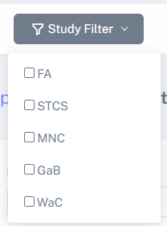
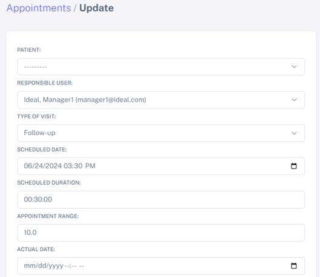

Troubleshooting IDEAL
##########################

Bulk patient import shows an error
*************************************

The most common error will be that the format of your CSV file does not match the format IDEAL expects to read. See doc:`users`, specfically `Define the data format of a study <https://nynuphar-ideal-doc.readthedocs.io/en/latest/study.html#define-the-data-format-of-a-study/>`_.

Manually adding a patient from the Hospital database to a study
*******************************************************************

Here do not forget to go "**Patients**" and then "**Create patient**" to search for the patient to be added. Once you found the patient, select the patient and don't forget to add the *Study Patient ID* before saving.

Editing a specific patient appointment shows no patient selected
*******************************************************************

If you are trying to edit an Appointment (**Apointments*** > **Appointments list** > **Edit appointment**), for a specific patient (for example, *Cristiano Ronaldo*):

.. image:: AppEdit.png

and no filter is selected:

then no patient will appear as selected, as shown below:

to fix the problem, just make sure your study is selected in the filtering menu above. 

.. note:: this bug will be fixed in a next release of IDEAL.
