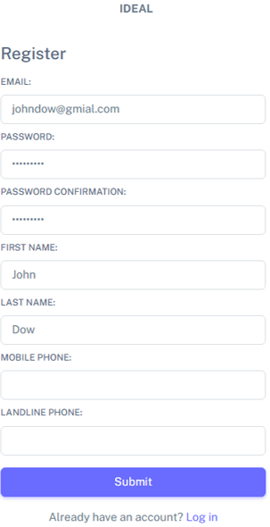
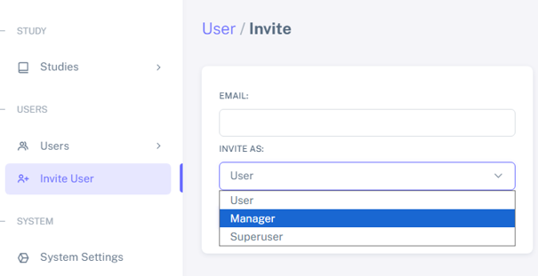
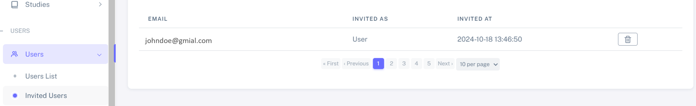
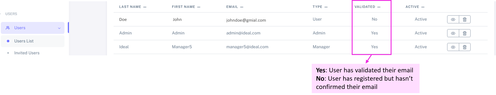
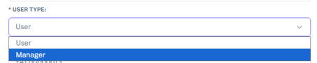
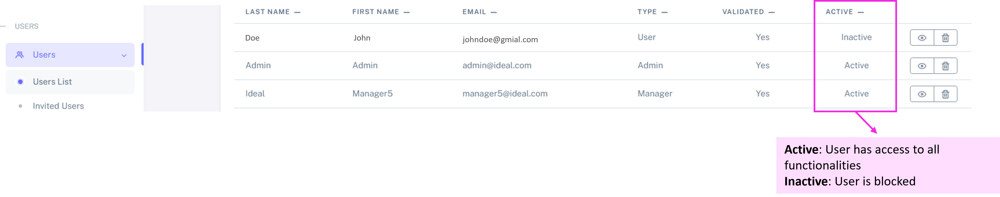
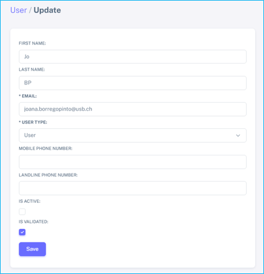

User registration and management
##################################

User registration
********************

There are 2 ways of creating an account on IDEAL:

1. Create an account directly in the main IDEAL page, by selecting "Create an account"
2. Get an invitation by a Superuser

Both ways will redirect you to the registration page (see below). Mandatory fields are: email, password, first and last name.

After registering, you'll receive an automatic email. Simply click the link provided to fully activate your account.

User management
*******************

As **Administrator** and **Superuser**, you can also manage the user access and account. Below we detail some of the functionalities available for these users.

Invite users
==============

To invite an user, please navigate to **Invite user** on the left menu.

Here you can specify the user's email and the respective role.

After inviting the user, you can monitor whether they have accepted the invitation by going to: **Users** > **Invited users**.

.. warning:: IDEAL only sends internal emails, which means only users from the respective hospital domain will receive an invitation email.

.. warning:: The invitation link is only active for 3 days. After this, you will have to ask for a new invitation (or register directly).

If a user registers but has not confirmed their email,  they will be listed as "not validated" in the Users List (**Users** > **Users List**).

Edit user
==================

Each user is able to change their own details. However, the Superuser and Administrator are also able to edit other users. For that, navigate to **Users** > **Users List** and select the "eye" icon in front of the user name. Then select "Edit User".

Change user role
-------------------

In the case below, an IDEAL *user* is becoming a *manager*. 

Inactivate an user
======================

IDEAL has implemented a functionality in which a User can easily be inactivated. This revokes their access to studies and patient data without deleting their account, ensuring they remain part of the audit logs.

In order to do this, navigate to **Users** > **Users List** and select the "eye" icon in front of the user name. Then select "Edit User". To inactive an user uncheck the box "is active" and *Save*.

If this box is rechecked, the user's permissions will be restored.
